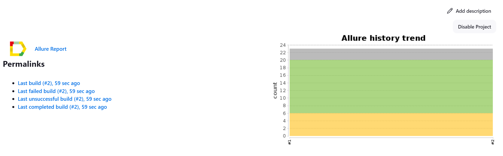
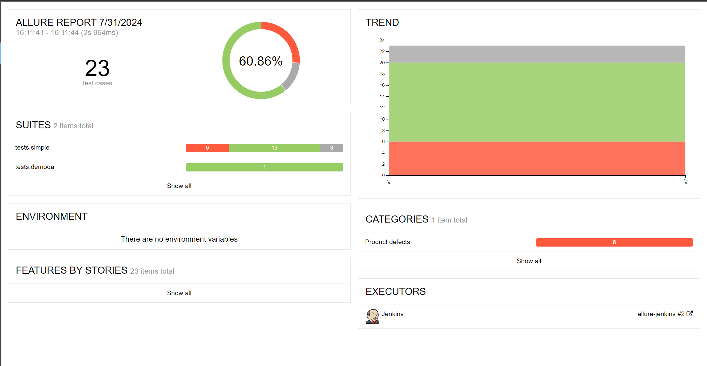
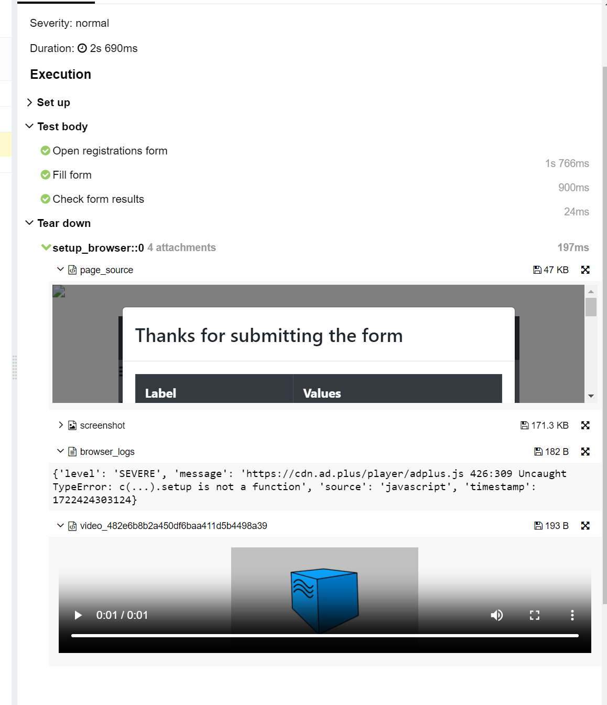
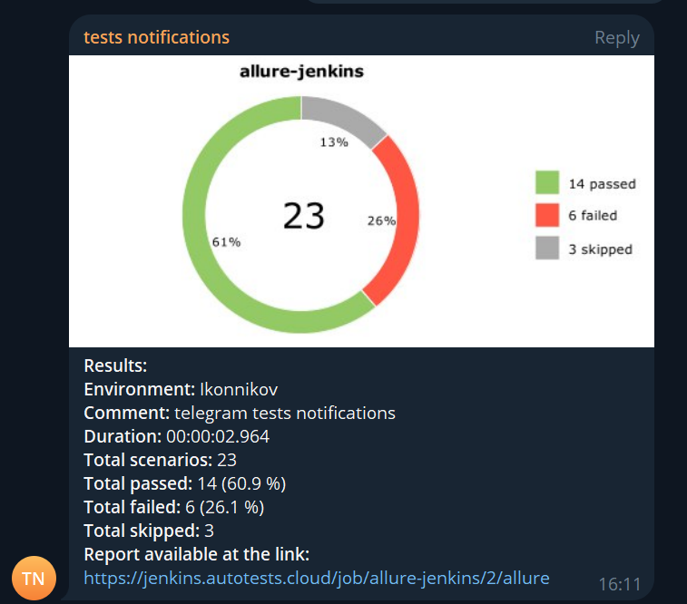
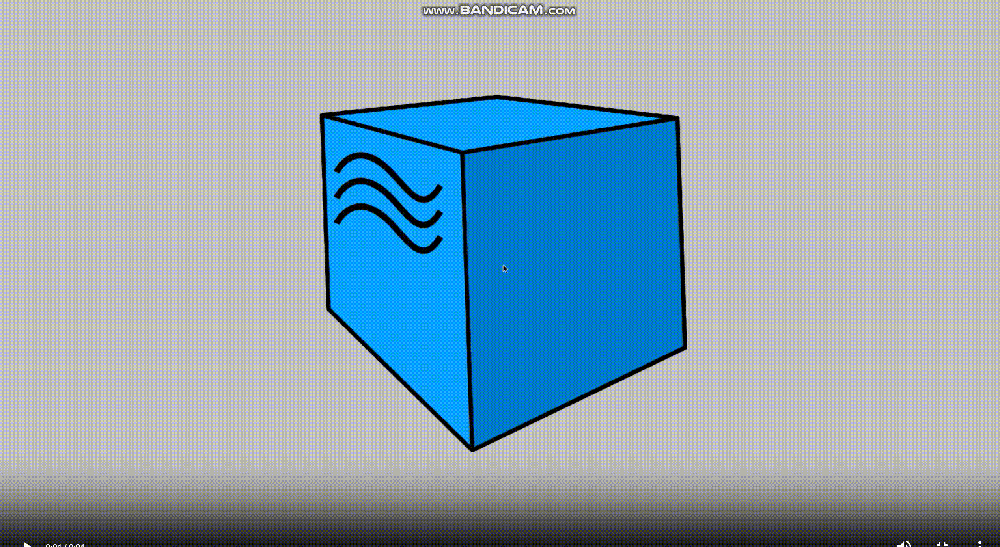

# Тестовое задание
Реализация набора автотестов (UI) для сервиса <code>https://demoqa.com/automation-practice-form</code>

Весь проект выполнен на языке <code>Python</code>, а также дополнительно:
 - для UI-тестов применялись: <code>Selene</code>

Запуск тестов и формирование отчетов о запусках формируется с помощью:
 - <code>Jenkins;</code>
 - <code>Selenoid;</code>

# Покрытый функционал

## <a href='https://github.com/AlexanderKashkin/diploma/tree/main/web/tests'>UI-тесты</a>
 - ввод данных пользователя;
 - проверка формы 

## Полезные ссылки
 - [Тестируемое web-приложение](https://demoqa.com/automation-practice-form);
 - [Job Jenkins](https://jenkins.autotests.cloud/job/allure-jenkins/);
 - [Allure report](https://jenkins.autotests.cloud/job/allure-jenkins/2/allure/).

## Запуск автотестов

```
python -m venv .venv
source .venv/bin/activate
pip install -r requirements.txt
pytest .
```

## Интеграция с Jenkins
- для запуска тестов на сервере настроена job'a в Jenkins.


## Интеграция с Allure
- после прохождения тестов будет собран отчёт на основе генератора Allure;

- к UI тестам приложены video, html, logs, screenshot;


## Нотификация в Telegram
- после прохождения тестов результаты будут отправлены в Telegram;  


## Пример прохождения UI-теста
